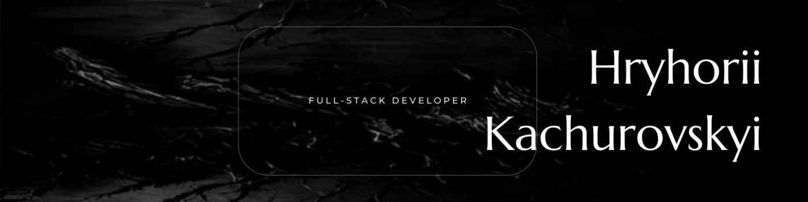

<h1>Hi, I'm Hryhorii!</h1>
<h2>
  🚀 About Me
</h2>

💻 I'm a front-end/full-stack developer with 2 years of experience in the IT field.

I implement modern front-end technologies such as React
to create interactive user interfaces. Using Node.js for
backend development and database management with
MongoDB.

🌍 English proficiency at B2 level

<h2>Other Information</h2>

- 🧒 Since childhood, I have loved various technologies, computers and computer games
- ⚡️ Additional fact - I play drums in my free time

<h2>🛠 Skills</h2>

  
  
  
  
  
  
  
  
  
  
  
  
  

 

  
  
  
  
  

<h3>🧠 I'm learning Now</h3>

  
  

 
<h1>Projects</h1>

<h3>Gadgets Online Store</h3>

A project designed to function as an e-commerce platform for mobile phones and other gadgets

<ul>
  <li>React</li>
  <li>Module SCSS</li>
  <li>BEM</li>
</ul>
<a href="https://github.com/FS-MAR24-CodeCrafters/react_phone-catalog">Code</a> | <a href="https://fs-mar24-codecrafters.github.io/react_phone-catalog/#/">Demo</a>

<h3>Task List Organizer App</h3>

An easy-to-use, intuitive application for managing everyday tasks

<ul>
  <li>React</li>
  <li>TypeScript</li>
  <li>Bulma</li>
  <li>Sass (SCSS)</li>
  <li>BEM</li>
</ul>
<a href="https://grigoryykach.github.io/todo-app/">Demo</a> | <a href="https://github.com/GrigoryyKach/todo-app">Code</a>

<h3>Nothing Phone Landing Page</h3>

Responsive static website designed to highlight Nothing Phone and related accessories.

<ul>
  <li>HTML</li>
  <li>Sass (SCSS)</li>
  <li>BEM</ul>
<a href="https://grigoryykach.github.io/nothing-landing/">Demo</a> | <a href="https://github.com/GrigoryyKach/nothing-landing">Code</a>

<h3>hLegal Landing Page</h3>

Responsive static website.

<ul>
  <li>HTML</li>
  <li>Sass (SCSS)</li>
  <li>BEM</ul>
<a href="https://grigoryykach.github.io/hlegal-landing/">Demo</a> | <a href="https://github.com/GrigoryyKach/hlegal-landing">Code</a>

<h1>🔗 Links</h1>

  
  
  
  

